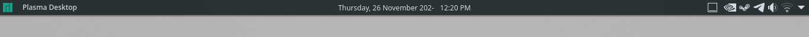
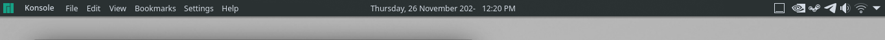
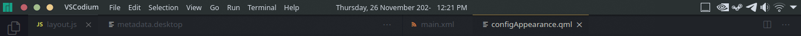
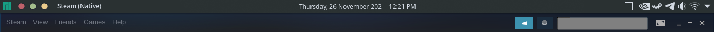

# Haze Panel
waimus' custom Plasma Desktop panel contains several preconfigured plasmoids. 

I wanted to save my customized panel and to be able to add it to a desktop with one click. I made this from available built-in templates by Plasma desktop installation in `/usr/share/plasma/layout-templates/` folder. 

I simply call it "Haze" because of my desktop wallpaper colour I'm using at the moment of making this.

## Images
 
> No window on desktop. 

 
> Active floating window. 

 
> Maximized window with global menu. 

 
> Maximized window with no global menu. 

## Requirements
This panel uses following external plasmoid widgets:
* Window Buttons Applet (org.kde.windowbuttons): https://github.com/psifidotos/applet-window-buttons
* Application Title (org.communia.apptitle): https://store.kde.org/p/1199712/
* Better Inline Clock (org.kde.plasma.betterinlineclock): https://store.kde.org/p/1245902/
* Panel Transparency Button (org.kde.paneltransparencybutton): https://store.kde.org/p/1338479/ 

Please make sure they are installed before adding Haze Panel.

## Installation
Simply place the `org.kde.plasma.desktop.hazePanel` folder to `~/.local/share/plasma/layout-templates/`. Then you can add the panel from desktop. 
 
Feel free to customize the setting from what I've set. Like the calendar formatting I personally set to `dddd, d MMMM 202-` because it's been 2- years since the Black Mesa Incident :D